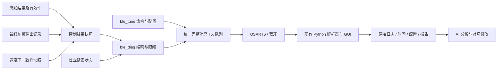

# 诊断遥测方案（第二版·复核修订）
 
修订日期：2026-09-19  
适用工程：`2-LXY传承/LXY传承-副本`  
状态：**设计已修订，固件与上位机改造尚未实施，未经实车验收。**

本文定义目标与架构；[诊断遥测实施方案.md](诊断遥测实施方案.md)定义协议、接入点和验收。本版取代旧文档中的固定时间轴、只改 main 两行、仅凭保持计数判断动作等安排。旧稿保存在[文档历史](文档历史/遥测修订前-20260919/诊断遥测实施方案.md)。遥测接口以新版实施方案为准；雷达升级方案继续负责雷达接收和控制改造。

## 1. 目的和实施边界

让“实车记录 → 上位机报告 → AI 分析 → 可追溯修改 → 对照试跑”得到可信证据。记录实际下发的 PWM、执行模式、感知有效性、真实时间与当时配置，能够解释失效和异常。

现有 26 个量只是诊断摘要，不是全部决策依据，也不足以重放完整点云算法。报告中的异常是待核查线索，不能自动认定为控制器根因。

本轮只修订文档。后续遥测实施允许在 main、舵机输出及速度共享量读取处增加必要记录点；保持现有控制算法及参数语义。DMA 改造、断点算法优化、PD 时间归一化及停机策略属于独立控制变更，分别构建、验证。遥测失效不会自动证明或实现电机安全停机。

## 2. 现状与设计必须分开

| 项目 | 当前源码 | 目标 |
|---|---|---|
| 蓝牙 UART | USART6，初始化 9600 | MCU 与实际模块一致配置 115200、8N1 |
| 现有遥测 | VOFA+，8×float32+4 B 尾，共 36 B | 保留兼容 |
| 诊断固件 | 尚无 ble_diag.c/h；tele/rate 尚未接入 | 新建诊断模块、命令和记录点 |
| 上位机 | 已有 V1/57 B 解析、GUI、报告和模拟数据 | 复用并修复，增加 V2 |
| 时间 | 根据收到的帧数×114.8 ms 推算 | 设备单调时间、控制序号、主机接收时间分别记录 |
| AI 分析 | 用户提交日志后分析 | 保持文件交付，增加配置和变更记录；无自动在线改固件功能 |

1798÷(4000÷12×47)≈114.8 ms 是按 LD14P 6 Hz 标称工况的名义点率推算的 DMA 块填满时间，不是整圈扫描周期，不是实测控制硬节拍；其他转速下点率是否恒定尚未实测。处理跳过、阻塞、丢包和 rate 都会改变观测。FRAME_DT 同时依赖缓冲长度与假设字节率，不能通过只改缓冲长度适配所有雷达。原“约 7.3 KB/s 实测吞吐”缺少本车验证依据，本版不作为验收前提。

## 3. 数据流与模块职责

- 感知与控制层提供只读结果快照；记录真实执行动作，不根据状态变量猜动作。
- ble_diag 负责模式、抽样、编码、健康消息，不执行转向或电机决策。
- bsp_bluetooth 是 USART6 发送的唯一入口，串行化遥测与命令应答。
- 上位机串口由单一读写所有者管理；界面展示和报告生成不得堵塞读取。

## 4. 保留旧协议，新增可信诊断

| 命令 | 行为 |
|---|---|
| tele 0 | 停止主动遥测，仍响应命令 |
| tele 1 | 原 36 B VOFA+ |
| tele 2 | V1/57 B 兼容流；时间和有效性能力有限 |
| tele 3 | V2 诊断，含时间、序号、有效标记、配置版本 |
| rate n | 每 n 个控制结果发一个 CONTROL，n=1～10；不是 Hz |

默认 tele 1。V2 头部、字段顺序、CRC、会话与命令规则见实施方案。不能把 V2 字段直接追加到 V1 帧中，也不能让旧解析器继续按 57 B 解新数据。

V2 分为 CONTROL、HEALTH、INFO/CONFIG、EVENT。无新点云时 HEALTH 仍可发送；不能重复旧 CONTROL 冒充控制仍更新。雷达接收、控制执行与遥测发送各有自己的序号/计数。

## 5. 吞吐与资源预算

UART 115200、8N1 的理论字节容量为 11520 B/s；无线实际吞吐、断连缓存和延迟须台架实测。

| 消息 | 单帧串行时间 | 现役标称估算约 8.713 次/s | M10P 目标 12 次/s | 压力预算 20 次/s |
|---|---:|---:|---:|---:|
| V1 57 B | 4.95 ms | 约 496.66 B/s，4.31% | 684 B/s，5.94% | 1140 B/s，9.90% |
| V2 CONTROL 108 B | 9.375 ms | 约 941.05 B/s，8.17% | 1296 B/s，11.25% | 2160 B/s，18.75% |

现役列按 1/FRAME_DT=15666.6667/1798 计算，并假设每个输入块恰好发送一次，不表示当前实测速率。12 次/s 对应 M10P 名义 12 Hz 且每圈一次控制、rate=1。20 次/s 是额外压力场景；M10 手册虽列 20 Hz 模式，其实际报文行为尚未验证，不能把此列当所有设备默认控制频率。M10 10 Hz 时，V1/V2 分别为 570/1080 B/s。压力测试应覆盖实际最高预期配置，20 次/s 只能作为明确标注的附加用例。

HEALTH 80 B，正常 1 Hz，失效时最多 5 Hz，额外 80～400 B/s；配置与事件另计。rate 默认 1，但最高控制频率下需重新核算，不能承诺任意频率全发。

V1 最小台架验证可以阻塞发送；完整方案使用 TXE 中断队列，无需蓝牙 DMA。串行发送时间不等于全部占用 CPU 的时间，也不等于主机接收延迟。

遥测预算上限建议：TX 池及描述符 1536 B、快照 256 B、组帧暂存 256 B、RX 命令增量 256 B、协议状态 512 B，静态增量合计≤2816 B；栈增长另计。这是设计约束，不能继续写“仅新增 57 B”。大块配置分片生成，不在 MCU RAM 中构建完整 JSON。最终以链接 map 和栈水位为准，并纳入雷达升级总预算，避免重复计算。

## 6. 可信分析的条件

每次录制保留：

- 原始 bin，以及接收块的文件偏移、字节数、主机 monotonic 时间。
- meta.json：run UUID、设备会话、固件/源码标识、雷达及算法、协议版本、rate、单位、完整参数快照、主机版本。
- events.jsonl：命令、ACK、参数实际生效时间与版本、重启及断连。
- CSV、报告和波形；无效值导出为空值/NaN，并保留原因标记。

设备时间用于控制周期，主机时间用于采集和通信观测。未同步时钟前，不能直接相减宣称端到端延迟。旧 V1 只有估计时间，报告必须降级，不输出“实际帧率”或虚假的精准异常持续时间。

CONTROL 帧长仍为 108 B：mask 的 bit 26/27 分别覆盖原始距离槽数/转速，bit 28～30 分别覆盖三个时间字段，bit 31 保留。零值和“未知”由有效位区分，时间戳不再使用全 1 哨兵；HEALTH 的时间有效性也有独立定义。具体位规则见实施方案 §6～7，不能沿用旧稿“仅26位有效”的解析约束。

采集时长使用明确的主机单调起止时间；接收字节速率使用同一窗口内实际读到的字节数。坏帧候选计数不能乘 57 当字节数，缺失帧也不能算作已接收字节。报告中的控制周期与这些接收统计分开。缺测会同时影响时长估计和事件计数，派生异常率的偏差方向不能预先保证。

速度按每行目标分析；异常窗口按时间定义；跨丢帧、复位和参数版本的差分断开。强制动作和 PD 动作分别分析。输出饱和、编码限幅、拟合无效、数据未更新分开统计。

AI 提修改时需指出具体 run、时间段、字段、配置及假设；一次只改变可归因的一层。现有命令未绑定的参数不能凭名称在线写入。修改后以 ACK 和精确配置回读确认，再做同条件对照。

## 7. 点云记录能力边界

26 个标量能定位控制异常，不能证明点云滤波正确。可选降采样 POINTS 必须记录扫描序号、取样角区、取样方法和原始有效点数，只用于辅助观察。完整算法回放应采完整原始报文。

20,000 点/s 即使每点仅 4 B 也需 80 KB/s，超出 115200 UART；不能把全量点云回传写为本方案保证。可选点云协议另行冻结后才能启用，不占用本版核心诊断验收。

## 8. 实施顺序

1. 固定字段与黄金报文，先完成主机离线解析/分析修复。
2. 现有 LD14P 上补真实输出记录、独立时间和失效状态，车轮不驱动时验证。
3. 配置实际蓝牙模块，接入统一 TX、V2、配置与事件。
4. 验证连续录制、断连、重启、在线改参和同时 get。
5. 留下现役基线，再与雷达升级分阶段衔接。

不要求先把 LD14P 的断点算法调到最优，也不把更换雷达作为遥测实施条件。具体门槛见实施方案。

