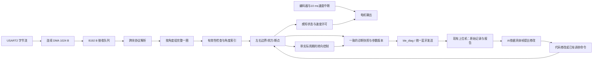

# 雷达接入与点云处理修改方案

> **更新入口（2026-09-19）：**已根据新增F407VET6读取资料生成第三版：[详细实施方案](雷达升级评审/01-雷达升级详细实施方案.md)、[兼容性、内存与风险评估](雷达升级评审/02-兼容性内存与风险评估.md)、[资料依据与验收清单](雷达升级评审/03-资料依据与验收清单.md)。以下正文保留为上一轮审查记录；与第三版冲突时以第三版为准。主要更新：示例70点压成2点不能照搬；实车ZG与工程VE配置需对齐；RAM预算提高到106.34 KiB；M10 GPS长度存在资料矛盾，未实测前不启用；不要求先全面改造LD14P才接入新雷达。

审查日期：2026-09-19。第二轮综合审查，已纳入《诊断遥测实施方案.md》、诊断设计文档、蓝牙调参说明书及现有上位机源码。本文是实施方案，尚未实施雷达替换，也没有实车验证结果。第二轮的主要修订及可复现证据见第 10～13 节。

## 1. 结论和适用工程

**DMA 可以修改，高点频雷达可以接入。先把现有“车端诊断→蓝牙→上位机→报告→修改→对照试跑”链路做可信，再将接收分块与扫描帧分开、接入新雷达。沿用已有调参与上位机模块，避免另做一套不兼容的遥测。**

主方案以 `LXY传承-副本` 为基线，兼容现役 LD14P 和候选 M10 串口雷达；按 M10P-20KHz 的吞吐量设计预算。用户尚未最终指定替换型号，因此不把 M10P-PHY 以太网方案混入串口方案。

| 工程 | 本次核对结果 | 实施定位 |
|---|---|---|
| LXY传承-副本 | USART2 + DMA1 Stream5；LXY 多模式转向；编码器速度 PI；蓝牙调参；8 通道遥测 | 主方案基线 |
| LXY传承(谢露规划算法) | 相同接收硬件，改用 XIELU_ProcessFrame；更多静态点云数组；解析器返回值与副本不同 | 共用接收设计，但必须单独做内存和算法适配 |
| LXY传承-原版 | USART6、2000 字节 DMA，沿用旧硬件配置 | 历史对照，不把它的引脚和缓冲长度套到现车 |
| 谢露/robocup | 原始谢露流程由 Test.c 驱动；工程目标芯片、执行器引脚与当前副本存在差异 | 算法来源参考 |

审查覆盖：四份工程的构建入口和版本差异；主用工程的 main、DMA、USART、点云处理、拟合/PD、速度 PI、定时器、PWM、舵机、电机、蓝牙及测试入口；谢露移植版完整处理链；上位机数据格式和时间轴；链接内存布局。厂商库和 CMSIS 按所用接口核对，不把随包示例当成本车功能。`main copy.c`、备用 PWM 目录和旧说明文档不代表当前运行入口。

本次对主用工程做了隔离构建：ARM Compiler 5.06 update 5，C99、O0、MicroLIB、分函数段，使用工程列出的 55 个 C/汇编源文件、DSP 库和现有 scatter。编译及链接成功，0 错误、44 条告警；告警包括未使用变量、隐式双精度转换、源文件多字节字符等。当前构建 RW+ZI 为 **58,216 B（56.85 KiB）**。这只证明现有源码可构建，不证明已有运行缺陷不存在。

构建记录：[build_review.json](/D:/OneDrive/Desktop/robocup/tmp/radar_review_build/build_review.json)；链接报告：[baseline.map](/D:/OneDrive/Desktop/robocup/tmp/radar_review_build/baseline.map)。产物只放在临时审查目录。

必须区分当前实现和已设计功能：车端仍为 9600 bps、36 B 的 8 通道 VOFA+；尚无 `ble_diag.c/.h`，`tele/rate` 尚未接入。上位机的 V1/57 B 解析、报告和 GUI 已存在，现有 log 中只有 demo 数据。《诊断遥测实施方案.md》已选定 115200 bps 与 26 字段诊断流，应作为扩展基线；目前不能宣称车端诊断已落地或本车蓝牙已实测达到 7.3 KB/s。

配套依据：[诊断遥测实施方案](/D:/OneDrive/Desktop/robocup/2-LXY传承/LXY传承-副本/诊断遥测实施方案.md)、[诊断遥测设计](/D:/OneDrive/Desktop/robocup/2-LXY传承/LXY传承-副本/诊断遥测方案.md)、[蓝牙调参说明书](/D:/OneDrive/Desktop/robocup/2-LXY传承/LXY传承-副本/蓝牙调参说明书.md)。这些文档中的“已完成”“实测”“不改其他模块”需按对应版本和范围理解，不能替代当前代码与真实试跑证据。

## 2. 必须纠正的前期判断

1. **高点频的负面影响不是雷达固有属性。** 1798 B 的旧接收块不能作为比较不同雷达的固定前提。正确接收与组帧后，12 Hz 雷达同方向的更新周期约为 83 ms，6 Hz 约为 167 ms；这是真实的潜在收益。
2. **LXY 的断点窗口并非直接作用于原始点间距。** main 先调用 HANDLE6/7，按 1° 步长、±0.5°容差提取左右边界，再交给 HANDLE8/9。不能按 0.54°→0.22°直接断言其窗口物理尺寸缩小一半。连续有效取样时，窗口通常约跨 5°；缺角时会更大，且候选选择会随密度改变。谢露规划版直接使用原始相邻点，其窗口需要另行评估。
3. **并非所有数组都需要扩到 2048。** 原始一圈点云需要更大容量，但现有侧边界和前方函数已经降采样；应把原始容量与算法工作容量分开。
4. **当前副本已经读取转速并发送第 8 遥测通道。** 不再按旧汇总中的“没有读取转速”设计任务。当前仍未做 LD14P CRC 校验。
5. **近距离精度表不能直接证明 M10 不适合。** ±3 cm 的标称值与实际噪声、系统偏差不同；低噪声多点拟合有收益，系统偏差不会因点多自动消失。管道材质、强光、安装高度和近距离有效率必须实测。
6. **滚动保存一圈点云不代表所有方向都是新数据。** 旧点来自过去的车身位置，急弯时混用可能扭曲边界。本方案先完成真正的单圈快照，滚动更新作为后续优化。

## 3. 当前代码中确认的问题

以下引用均对应本次读取的工作区版本；用户继续修改文件后，行号可能变化。

| 位置 | 已确认的行为 | 修改要求 |
|---|---|---|
| [DMA.c:47](/D:/OneDrive/Desktop/robocup/2-LXY传承/LXY传承-副本/HARDWARE/DMA/DMA.c:47)、[DMA.c:75](/D:/OneDrive/Desktop/robocup/2-LXY传承/LXY传承-副本/HARDWARE/DMA/DMA.c:75) | Normal 模式；满块后停 DMA、拷贝、重启；只有一个就绪位和一份处理缓冲 | 连续接收；区分写入与读取所有权；记录积压/溢出，避免 ISR 覆盖主循环正在解析的数据 |
| [DMA.h:22](/D:/OneDrive/Desktop/robocup/2-LXY传承/LXY传承-副本/HARDWARE/DMA/DMA.h:22) | ISR 共享标志声明不是 volatile | 新共享索引按 ISR 通信规则声明并同步；volatile 本身不解决缓冲覆盖问题 |
| [LEIDA_DATA.c:70](/D:/OneDrive/Desktop/robocup/2-LXY传承/LXY传承-副本/HARDWARE/LEIDA_DATA/LEIDA_DATA.c:70) | 找三个相隔 47 B 的 0x54；无 CRC/VerLen 验证、无跨块尾包保留；坏头位置仍可推进 j；返回 0/1 | 流式解析、跨块拼包、合法包才追加点、返回真实点数或完整扫描对象 |
| [main.c:204](/D:/OneDrive/Desktop/robocup/2-LXY传承/LXY传承-副本/USER/main.c:204) | 忽略解析返回值，过滤固定 800 个位置 | 必须只处理本次成功写入的点；解析失败不能再次使用旧点 |
| [LEIDA_DATA.c:192](/D:/OneDrive/Desktop/robocup/2-LXY传承/LXY传承-副本/HARDWARE/LEIDA_DATA/LEIDA_DATA.c:192) | 固定掐头尾各 10 点，仅检查距离≥100 | 改成逐点有效性判断；删除依赖 DMA 块边界的固定裁剪 |
| [LEIDA_DATA.c:262](/D:/OneDrive/Desktop/robocup/2-LXY传承/LXY传承-副本/HARDWARE/LEIDA_DATA/LEIDA_DATA.c:262) | 中线角度配对失败时，已找到的一侧索引可能带入下一角度；索引 0 被当作未找到 | 每个目标角独立初始化两侧索引，使用 -1/独立有效标志 |
| [LEIDA_DATA.c:318](/D:/OneDrive/Desktop/robocup/2-LXY传承/LXY传承-副本/HARDWARE/LEIDA_DATA/LEIDA_DATA.c:318)、[LEIDA_DATA.c:656](/D:/OneDrive/Desktop/robocup/2-LXY传承/LXY传承-副本/HARDWARE/LEIDA_DATA/LEIDA_DATA.c:656) | 存在除以 center_cnt、counter-4；极值筛选依赖足够不同的点 | 点数不足或退化数据返回明确无效状态；所有拟合、索引、除法前检查范围和有限性 |
| [LEIDA_DATA.c:350](/D:/OneDrive/Desktop/robocup/2-LXY传承/LXY传承-副本/HARDWARE/LEIDA_DATA/LEIDA_DATA.c:350) | 边界取样选容差内第一个点；缺失角度被压缩掉 | 明确代表点规则，保留缺角信息；断点检测禁止跨大缺角当连续点 |
| [main.c:222](/D:/OneDrive/Desktop/robocup/2-LXY传承/LXY传承-副本/USER/main.c:222) | 赛道宽度估计只接受 600～900 mm，否则保留旧值，初始 700 mm | 对约 1 m 实际赛道先标定宽度；用置信度和可配置范围替代硬编码门限 |
| [main.c:101](/D:/OneDrive/Desktop/robocup/2-LXY传承/LXY传承-副本/USER/main.c:101)、[main.c:123](/D:/OneDrive/Desktop/robocup/2-LXY传承/LXY传承-副本/USER/main.c:123) | servo_pwm 未初始化；舵机初始化传入 144.5 后截为 144，而驱动直接写定时器 CCR；PD 的中位参数为 uint16_t，144.5 又会截断 | 初始 PWM 明确为 1445；统一 PWM 单位，PD 内部保留浮点或统一用定时器计数，最终输出统一限幅 |
| [main.c:213](/D:/OneDrive/Desktop/robocup/2-LXY传承/LXY传承-副本/USER/main.c:213)、[timer.c:84](/D:/OneDrive/Desktop/robocup/2-LXY传承/LXY传承-副本/HARDWARE/LEIDA_TIMER/timer.c:84) | 雷达无效时仅 continue，速度中断仍按目标速度运行；启动电机设为 90% | 建立感知就绪/失效状态与电机使能门控；失效后不能仅依赖主循环继续等待 |
| [CENTRE_LINE.c:349](/D:/OneDrive/Desktop/robocup/2-LXY传承/LXY传承-副本/HARDWARE/CENTRE_LINE/CENTRE_LINE.c:349) | D 项是 kd×误差差，没有 dt；模式保持按帧计数 | 引入时间间隔；模式保持改为时长，模式切换时重置相应历史状态 |
| [ble_tune.c:94](/D:/OneDrive/Desktop/robocup/2-LXY传承/LXY传承-副本/HARDWARE/hc-05/ble_tune.c:94)、[bsp_bluetooth.c:106](/D:/OneDrive/Desktop/robocup/2-LXY传承/LXY传承-副本/HARDWARE/hc-05/bsp_bluetooth.c:106) | 当前蓝牙 9600 bps，36 B 遥测逐字节等待发送 | 当前线路占用约 37.5 ms/次。按已有方案升级 115200 后，57 B 仅约 4.95 ms；不能继续按 37 ms 论证。融合版本使用统一非阻塞 TX 队列；最小台架版可先保留阻塞发送，实测调度余量 |
| [usart.c:24](/D:/OneDrive/Desktop/robocup/2-LXY传承/LXY传承-副本/SYSTEM/usart/usart.c:24)、[CENTRE_LINE.c:340](/D:/OneDrive/Desktop/robocup/2-LXY传承/LXY传承-副本/HARDWARE/CENTRE_LINE/CENTRE_LINE.c:340) | printf 实际发 USART3，115200 bps 阻塞；控制路径多次打印浮点 | 比赛配置关闭逐帧 printf；诊断数据通过非阻塞队列输出，不能在输出舵机前等待日志 |
| [PWM.c:236](/D:/OneDrive/Desktop/robocup/2-LXY传承/LXY传承-副本/HARDWARE/TIM/PWM/PWM.c:236) | TIM9 覆盖 PA2 的 USART2_TX 复用 | 只在 LD14P 配置启用该 PWM；M10 若需发启动命令必须保留 USART2_TX |
| [robocup_telemetry.py:90](/D:/OneDrive/Desktop/robocup/2-LXY传承/LXY传承-副本/上位机/robocup_telemetry.py:90) | 上位机时间轴按固定 114.8 ms/帧推算 | 新遥测加入设备时间戳、扫描序号和实际周期；丢帧不能让时间轴缩短 |

这些是静态代码确认的问题或风险路径，不表示每次实车运行都会触发。

## 4. 推荐数据链路

### 4.1 连续接收，DMA 块不再等于算法帧

首版建议：1024 B 循环 DMA，半传输/全传输各交付 512 B；ISR 将已完成半块复制到 8192 B 单生产者/单消费者字节队列。DMA 不停止、不重装接收计数。ISR 只复制、更新索引和错误计数，不解析点云、不打印、不控制舵机。

- 512000 bps、8N1 的线路最大速率为 51,200 B/s，DMA 半块最快约 10 ms 填满。ISR 必须在该半块再次被 DMA 写入前完成复制；记录最坏中断延迟与复制耗时来验证。
- 8192 B 队列在最大线路速率下约容纳 160 ms 数据；它用于短暂调度抖动，不能容许持续处理积压。
- 共享生产/消费索引采用对齐的计数器、明确发布顺序和必要的内存屏障/短临界区。ISR 不能覆盖消费者尚未释放的字节。
- 队列满或 DMA/UART 错误必须增加计数并标记“数据不连续”。随后丢弃不完整包和当前不完整扫描，重新同步；不能把丢失前后字节直接拼成正常扫描。
- UART ORE/FE/NE、DMA TE/DME/FE 必须有清除和恢复路径；恢复属于异常处理，正常接收不暂停。
- 尾部不足 512 B 的数据在下一半块中处理；本版本不依赖 UART IDLE 作为扫描结束条件。若后续增加 IDLE 加速，需要防止与 HT/TC 重复消费。

### 4.2 协议层独立于赛道算法

建议新增 `lidar_protocol.c/.h`，由编译配置选定 LD14P、M10-10K 或 M10P-20K；避免靠相似帧头自动猜型号。

| 项目 | LD14P | M10-10K（无 GPS） | M10P-20K |
|---|---|---|---|
| 串口 | 230400、8N1 | 460800、8N1 | 512000、8N1 |
| 包长 | 47 B | 92 B | 160 B，长度字段核对 |
| 帧验证 | 0x54、0x2C、CRC-8 | A5 5A、合法角度/速度、固定长度、FA FB | A5 5A、长度、合法角度/速度、FA FB |
| 距离处理 | 小端，mm，保留质量字段 | 大端，先排除 0xFFFF | 先排除原始 0xFFFF，再取 raw & 0x7FFF；保留高反标志 |
| 插值 | 按开发手册使用结束角减起始角除以 11，处理跨 360° | 按厂家文档的有效点数 m 等分 15° | 同左，m=0 不除法 |

字节流按“找头→等待包齐→验证→解包”处理；验证失败向后移动一个字节重同步。跨 DMA 边界的半包必须保留。LD14P 的 CRC 使用手册表/样例校验，不凭名称套用其他 CRC 变种。

M10 的 `0xFFFF` 与实际角度映射要用真实报文核实：厂家文档明确以实际有效点数 m 分配角度，先按文档实现；用部分无效点场景确认本机固件是否一致。不能把其他 M10 型号的高反位、GPS 长度、启停命令复制过来。M10-10K 的 GPS 版 103 B 格式必须另设配置。

**接入前置条件：**确认具体设备上电是否输出；若需要串口启动，拿到该固件可用的原始报文并台架验证。现有 M10P 文档只有 ROS 话题，不能据此编造串口命令。

### 4.3 按角度组一圈，先不要无限保留旧点

新增 `lidar_scan.c/.h`。使用原始扫描方向和角度回绕识别扫描边界；首次同步只从选定切点开始收，丢弃启动时的半圈。切点尽量设置在车后，避免前方边界在扫描帧头尾被人为拆开。

每份扫描包含：序号、开始/结束接收时间、点数、实际扫描周期、数据连续性、收到包的角度覆盖及有效回波覆盖。包已收到但无回波，与包根本没收到必须分开记录。

原始扫描采用两份独立缓冲，每份上限 **2048 点**；一个缓冲写入，一个供算法读取，状态为 FREE/WRITING/READY/READING。禁止覆盖 READING 缓冲；处理来不及则计数并丢弃未消费旧快照，优先最新完整扫描，不积压旧控制命令。

建议紧凑点结构为 8 B：`uint16_t angle_cdeg, range_mm, offset_100us; uint8_t quality, flags`。相对时间从本圈开始计算；时间戳是接收/估计时刻，不宣称为精准激光发射时刻。慢速启动导致单圈超过容量时，整圈标为不可用；正常转速和覆盖恢复后才发布，不截断为“有效完整圈”。

M10P 按每包 15°、每包 70 点计算，24 包一圈为 1680 点、3840 B；与“20,000点/秒、12 Hz”推导的约 1667 点略有差异，来自标称值取整。**因此使用角度边界，不靠固定字节数判定一圈。**

首版每个有效扫描只执行一次感知和 PD。可预期的扫描节奏是 LD14P 默认约 6 Hz、M10P 约 12 Hz；这是扫描周期，不等于最坏检测到执行器动作的端到端延迟，后者还要加扫描相位、传输/排队、计算及舵机响应。

LD14P 改成整圈后，旧的约 8.7 次/秒“分块决策”会变成约 6 次/秒“完整圈决策”。信息覆盖更明确，但更新次数下降，不能预先保证跑得更好；首次动态试车前必须完成 dt/失效处理，并对比入弯响应。若完整圈等待确实成为限制，再以有时间标记的前半圈/扇区快照优化，不能退回无时间语义的固定字节块。

之后若要做滚动扇区更新，需逐扇区记录时间、控制新旧点最大时间差，并评估运动畸变。不要把旧一圈按固定 50 Hz 重复送 PD，伪造新的传感器信息。

### 4.4 原始点云大容量，旧算法保持小容量

主用 LXY 算法首版增加 0.5°角度索引，最多 720 个候选位置；可在现有 800 点工作数组内生成紧凑输入。侧边界仍按原先约 1°提取，前方仍按 1°提取，中线的目标角度和容差首先保持可对照。

- 每格选择最接近目标角的有效实测点；保留实际角度，不把点强行挪到格中心。不跨空格插值。
- 同一格内若存在明显近、远两簇，标记不一致，不把两面物体平均成虚假墙面；后续可比较局部一致簇选点与稳健拟合。
- 断点函数除距离跳变外，还检查相邻点角度间隔和数据有效性。缺测表示未知，不能直接当作弯道，也不能强行填成管道。
- 边界配对每次重置索引；点数不足、角度缺失、退化拟合均返回明确状态，不能仅返回 k=0 或距离=0 让下游猜原因。
- 400 mm 跳变、550 mm 入弯阈值可作为旧车对照的起点，不按点频比例缩放；依据管道间隙/真实弯道回放重新标定。
- 约 1 m 赛道需实测雷达扫描高度处的有效通道宽度。圆管截面、雷达偏心和车身姿态会影响左右距离，不能把直径或名义赛道宽度直接写成感知值。

高密度点暂时降采样是兼容旧算法的第一阶段。完整原始点仍保留在扫描缓存中，后续可在局部拟合时利用全部有效点；不要把“保留全部点”理解成“每个旧函数必须遍历全部点”。

## 5. 内存和处理时间预算

主用 `LEIDA_DATA.c` 有 3 个全容量数组、9 个半容量数组，元素均为两个 float（8 B），另有 3×200 个前方点。因此仅这些数组为：

`3×N×8 + 9×(N/2)×8 + 3×200×8 = 60N + 4800 B`（N 为偶数）。

| 全局 LEIDA_DATA_COUNTER | 这些数组占用 | 结论 |
|---|---:|---|
| 800 | 52,800 B | 现状 |
| 1680 | 105,600 B | 还没算接收缓冲、其他全局变量和栈 |
| 2048 | 127,680 B | 已接近链接配置的全部 131,072 B，不能这样整体扩容 |

推荐方案预算以本次 58,216 B 构建为基数，保守保留旧算法数组：

| 项目 | 预算 |
|---|---:|
| 当前 RW+ZI | 58,216 B |
| 移除旧两份 1798 B 接收缓冲 | −3,596 B |
| 连续 DMA 缓冲 | +1,024 B |
| 接收字节队列 | +8,192 B |
| 两份 2048×8 B 原始扫描 | +32,768 B |
| 上述小计 | **96,604 B，约 94.34 KiB** |

小计尚不含新角度索引、有效标志、TX 队列、协议状态和栈扩容。为这些新增项目预留约 8 KiB，预计总量约 102～103 KiB；最终以新构建 map 为准。建议约束：角度索引 1440 B、有效标志 720 B、统一 TX 存储池及描述符总计≤1536 B、RX 命令工作区增量≤256 B、诊断快照≤256 B、组帧暂存≤256 B、协议/统计/元数据状态≤512 B、栈较现状增加 2048 B，共 7024 B，余下 1168 B 留作对齐及变更余量。不能把各模块各自“只加一点”重复叠加而不统计。当前栈仅 1024 B、堆 512 B，需要静态调用链及栈水位检查；大数组全部静态分配，不放函数栈。

当前 scatter 只使用 `0x20000000` 的 128 KiB 区域。不要把芯片其他 RAM 区域简单加到本预算中。谢露规划版历史 map 为 100,968 B，直接叠加上述缓存会超出现有链接区域；应先合并重复中间数组、重用生命周期不重叠的缓存，再独立链接验证。

计算成本不能凭 MCU 主频保证：当前宽度估计存在双重遍历，边界与中线存在“每个目标角重新扫所有点”。首版通过角度索引缩小检索范围；记录解析、组帧、感知、控制的平均/P99/最大耗时及队列峰值。

验收目标设为：持续最高配置速率下 UART/DMA/队列溢出计数为 0，队列占用不随时间增长；每圈处理时间明显小于最短有效扫描周期，建议保留至少一半周期余量。这是待验证目标，不是已测性能。

## 6. 控制、时间基准与通信

### 6.1 舵机

统一以定时器计数表达最终 PWM：中位 1445、限位 1170～1720，初始化与正常运行走相同限幅出口。修复局部 `servo_pwm` 未初始化和中位整数截断；遥测读取最终实际下发值，包括直接打满、保持和失效分支。若将 PD 内部从 PWM/10 单位整体改为 PWM，旧 kp/kd 的数值也必须按输出尺度换算；第一阶段更稳妥的做法是只将 PD 中位参数改为 float，保留其内部尺度，最终输出统一限幅。记录“已下发 CCR 命令”，不将其称为已测得的舵机物理角度。

现有 LXY PD 可先保留误差定义及分模式结构。首版增加 `dt`，用 `kd_old × T_ref/dt × (err-err_prev)` 迁移旧 D 项，`T_ref` 取实测旧控制周期；或定义连续时间系数 `Kd = kd_old×T_ref`。禁止直接沿用原 kd 再除以秒数。dt 异常、长时间丢扫描、模式改变时重置/抑制 D，加入可调低通和限幅。

模式保持的“1帧/2帧”改成毫秒，起点采用旧行为的实测持续时间。更改接收方式后不一定所有 kp 都必须重调；首先固定车速、几何参数，逐组验证 kp，再调整 kd。

### 6.2 时间与电机

新增独立单调时钟，例如核对未占用后用 TIM6 提供 1 ms 时间基准，微秒级性能测量使用 DWT/独立计数器。现有 delay.c 会改写 SysTick，不能直接把 SysTick 改成系统时钟而继续原样调用延时函数。

速度环继续 10 ms 工作，但增加电机许可状态：启动时 PWM=0，收到稳定有效扫描并具备可用边界后才允许进入目标速度。扫描超时、队列溢出后持续感知失效、拟合持续无效时撤销许可并输出 0；复位 PI 积分，避免仅把目标速度设 0 后残余积分仍驱动电机。

失效时间门限根据实际扫描周期、车速和可用停车距离标定，不把“等两三圈”当普适安全值。当前 Speed_now 来自编码器转速换算，不能直接当 m/s；需轮径/实测距离标定后才能计算行进距离和制动裕量。

### 6.3 复用诊断模块与 115200 蓝牙链路

采用已有实施方案确定的 115200 bps，MCU 和实际 HC-05 模块分别配置并核验。保留 `ble_tune` 的既有命令，新增其已规划的 `ble_diag`，由它负责模式、诊断快照编码和限频；复用两份上位机脚本的采集、CSV、报告和波形，不另建工具。

57 B V1 帧在 115200 下约占 4.95 ms；12 Hz 时 684 B/s、20 Hz 时 1140 B/s，分别占 UART 理论有效容量 5.94% 和 9.90%。因此，最小诊断台架版本可先用已有阻塞发送验证编码和接收；上一版把“立即非阻塞、9600 下限到 5～10 Hz”作为必要条件不准确。量产融合版本推荐统一 TXE 中断发送，以减少 get、多种消息和点云诊断对控制周期的扰动；蓝牙 TX 无需新增 DMA。

统一 TX 队列在 `bsp_bluetooth` 内实现：VOFA+、诊断、命令 ACK、get 回显均以完整消息入队。只有这个发送器能写 USART6 DR；旧 `BLE_Send_Bit/Send_Bluetooth_Data` 的调用点必须一并适配，不能边用队列边直接写 DR。只可淘汰尚未发送的低优先级完整遥测，不能截断正在发送的帧；命令回复优先、保留空间，队列满时记录计数，不能静默应用参数却无应答。中断 ISR 不组帧、不打印。

`tele 0` 真正关闭遥测但保留命令回复；`tele 1` 保留 8 通道 VOFA+；`tele 2` 保留 V1/57 B 兼容；新增 `tele 3` 使用第 11 节的 V2 诊断。`rate n` 仍表示每 n 次控制结果发送一次诊断，不能暗中改变成 Hz。各遥测模式互斥，GUI 经能力查询/ACK 确认后选择模式；旧固件返回 ERR name 时显示未支持，不宣称已成功切换。

USART3 诊断打印同样退出实时控制路径。V2 使用设备时间戳、扫描序号与参数版本，原 114.8 ms 常数仅用于旧日志的明确标注估计。通过只改变 rate 不能测出真实扫描频率，也不能用收到的遥测数量代替实际控制周期。

## 7. 按文件实施顺序

| 阶段 | 修改位置 | 完成标准 |
|---|---|---|
| 0：诊断闭环先可信 | ble_diag、ble_tune、bsp_bluetooth、两份上位机；补少量控制快照记录点 | 修复第 10 节缺陷；先在不驱动车轮的台架验证 V1 编解码和实际 PWM/模式，再用 V2 时间及有效性字段建立升级前基线；具备配置信息和每次独立采集 |
| A：修复现役链路 | main、LEIDA_DATA、CENTRE_LINE、timer、Servo | 实际点数贯穿；失效与退化输入有状态；PWM 单位一致；可停机；先建立 LD14P 可比较基线 |
| B：解耦连续接收 | DMA、USART；新增 lidar_rx、lidar_protocol、lidar_scan | LD14P 仍工作；CRC 正确；任意分块不丢包；实际完整圈；错误计数可观测 |
| C：综合压力与时序验证 | 统一 TX、时间模块、快照、上位机 | 遥测开关不显著改变控制周期；真实时间轴；雷达接收与蓝牙双向通信同时稳定 |
| D：接入新雷达 | 型号配置、协议模块、PA2/供电适配、scan 参数 | 正确识别无效/高反数据；启动与坐标标定通过；正常一圈无截断 |
| E：赛道标定 | LEIDA_DATA 的取样/断点/宽度；CENTRE_LINE 的 dt/PD；main 状态机 | 管道缝隙不误触发、真实弯道不漏判；同速对照后再提速 |

阶段 0/A/B/C 在 LD14P 上分步完成，形成可对照记录和独立还原点。时间基准在阶段 0 引入，dt、失效门控在改变控制节奏前完成；阶段 C 是综合验证，不是到此才开始补时间。切换新雷达前这些条件必须成立。新增源文件同时加入 `USER/Template.uvprojx`、`USER/.eide/eide.yml` 和项目根 `.eide/eide.yml`，防止不同入口烧出不同功能。每次只改一个可验证层次，保存改前/改后 run，避免同时换雷达、改采样、改控制器后无法归因。

`LXY传承(谢露规划算法)` 的适配单独处理：其 HANDLE1 返回 j，但坏包仍可能推进 j；XIELU 的重排函数依赖输入顺序/完整性，应直接接受组好的有序扫描替换旧重排假设；原始相邻点滤波、断点窗口和原始点数门限要重标。不能只拷贝主用版 720 点输入后认为两套算法行为一致。

## 8. 验证与交付门槛

1. **协议离线测试：**手册样例、任意字节位置切包、多包连发、头部噪声、坏 CRC、错误长度/尾、丢字节、插字节、零有效点、0xFFFF、高反位、359°→0°。相同输入以任意块长喂入，输出一致；旧数据不得残留。
2. **扫描测试：**从任意角度启动、丢一个扇区、重复包、数据乱序、超出 2048 点、掉线后恢复。首次半圈不发布，缺包状态可辨识；缓冲读写不重叠；算法只处理新序号。
3. **几何/控制回放：**空点云、单侧墙、无前方回波、平行墙、全部同距离、少量点、窄间隙、真实拐角、斜坡/起伏导致缺测。无越界、NaN/Inf、未初始化 PWM；失效不能静默解释为正常直道。
4. **串口压力测试：**按候选设备真实报文持续回放，开启蓝牙遥测并反复 get/调参，记录至少 10 分钟的错误计数、最大队列占用和处理耗时。压力测试本身不驱动车轮。
5. **实物静态测试：**实际铝管在 0.1/0.2/0.5/1/2 m、不同角度和光照下记录有效率、偏差和抖动；管缝后分别放近物、远物和空场，检查假断点；校准扫描高度及前左右坐标。
6. **低速实车对照：**同一赛道、同一目标速度，分别记录 LD14P 与新雷达的碰撞/脱轨次数、假断点、丢弯、方向摆动和完成时间。先验证接入正确，再逐步提高速度，不能以静态点数增加代替比赛收益。

赛道规则还允许岔路、障碍和起停线；当前主用流程主要是边界循迹与转弯，未见完整的岔路任务规划和起停线识别闭环。雷达替换不会自动补齐这些功能，应作为独立需求设计和验收。

## 9. 开工前需要落实的实物信息

- 最终替换型号与固件、串口或定制以太网接口、实际包格式及上电行为。
- 雷达供电、接头、安装孔和扫描平面高度；M10 串口不能套用 PHY 版供电。
- 实车实际烧录的是本方案基线还是谢露规划版；当前工作区包含多份工程，不能用目录名推断车上固件。
- 实测赛道有效宽度、目标车速、雷达扫描周期、原始报文和失败场景。

这些信息影响最终驱动配置和参数，不妨碍先完成共同的数据链路修复。**可可靠给出的方案是：分离接收队列、协议解析、扫描缓存和算法工作集；具体舵机增益及比赛速度必须由回放和实车结果确定。**

## 10. 诊断遥测复核结果

本轮同时审阅《诊断遥测实施方案.md》、实际蓝牙与控制代码、`上位机/robocup_telemetry.py` 和 `robocup_gui.py`。必须区分现状与设计：固件目前仍是 9600 和既有遥测，方案中的 115200、ble_diag、tele/rate 命令尚不能视为已落地；上位机已有实现和模拟日志，但未据此证明实车链路通过。现有流程是采集文件交给 AI 分析，并非已有 AI 自动在线修改固件的系统。

| 优先级 | 发现 | 修订要求 |
|---|---|---|
| P0 | 诊断草案先定标再按物理单位限幅：err=500 会解码成 60，k=0.5 会成 0.03 | 先判有限值、按物理单位限幅，再定标、舍入，最后按 int16 范围饱和；标记无效与饱和。不能只修改上位机补偿错误 |
| P0 | 草案 `mode != 2` 回退旧遥测，因此 tele 0 仍会发送 | 显式处理 off、VOFA、V1、V2；关闭遥测仍允许命令应答 |
| P0 | main 的失效分支提前 continue；单一正常出口埋点看不到失效。强制转向未同步局部 servo_pwm，pid_select 也未覆盖实际调用的 5/7 模式 | 在最终 PWM 出口记录已下发值；记录实际执行模式和动作原因；失效路径也发布状态，独立心跳揭示持续无数据 |
| P1 | 上位机按 FRAME_DT=114.8 ms 构造时间；丢帧、rate 和新雷达周期未进入时间轴 | V2 使用设备时间；V1 只能标注估计时间，禁止把固定推算的 8.713 Hz 当实测频率 |
| P1 | V1 校验仅覆盖载荷，不保护 seq；8 位序号不能充分区分丢包、复位和长时间断开 | 保留兼容解码，同时提供保护头部、会话及宽序号的 V2 |
| P1 | 速度分析用首行目标速度比较全程 | 每行使用对应目标，按参数版本分段；实际值与目标同时由 8 改到 10 的样本应无误差，现代码会报平均误差 1 |
| P1 | GUI 开始采集时不重置完整解析状态；多次采集可能累加，监视数据和原始录制范围也不一致 | 独立监视与录制状态；每个 run 新建解析器、原始文件、元数据与报告 |
| P1 | 启动采集发 tele 2 后延时并清接收缓冲，会丢弃 ACK，且未验证切换成功 | 能力查询、命令 ACK 和状态确认；未知旧固件明确降级，不盲目宣告诊断已开启 |
| P1 | 原 get 使用有限精度；例如 .0395 的增益无法通过现有千分位命令无损回写 | 新增精确配置快照，记录参数单位、原值、版本；原命令继续兼容，不能把显示舍入值当精确备份 |

离线探针结果保存在 `tmp/radar_telemetry_audit/checks.json`：序号 1→3 被判丢一帧，但时间只前进一个周期；仅篡改 seq 仍通过 V1 校验；动态目标误差和草案定标问题均得到复现。前两项和动态目标使用当前 Python 解析/分析实现验证，定标项复现草案公式。它们不是新固件测试，也不是实车测试。

还需修正报告口径：固定帧数的“持续异常”改为按时间窗口；无效、未更新和限幅数据分别处理；V1 CSV 实际列数为 31，不能沿用文档的 29 列描述。USART3 的 printf 不能证明蓝牙配置成功，应以蓝牙链路命令应答核验。

## 11. 兼容诊断协议与快照设计

以下 V2 尚未实现，具体接口以[诊断遥测实施方案第二版](2-LXY传承/LXY传承-副本/诊断遥测实施方案.md)为准。保留 V1 的 57 B 和 26 字段顺序，不能直接追加字段破坏现有解析器；新增 tele 3，经能力协商启用。主机必须按版本分派解析，并约束合法类型、长度及重同步策略。可选 POINTS 不属于本版已定义消息，需另行冻结。

### 11.1 V2 帧结构

全部多字节整数为小端。公共头 14 B，末尾 CRC16 2 B，总帧长 16～256 B：

| 字节偏移 | 字段 |
|---|---|
| 0～1 | AA 55 |
| 2 | version=2 |
| 3 | 消息类型：CONTROL、HEALTH、INFO/CONFIG、EVENT、可选 POINTS |
| 4～5 | 总帧长 uint16，包含头和 CRC |
| 6～9 | tx_seq uint32 |
| 10～13 | session_id uint32 |
| 14～末尾前 2 B | 对应类型载荷 |
| 最后 2 B | CRC16/CCITT-FALSE，小端存放 |

CRC 参数：poly=0x1021、init=0xFFFF、不反射、xorout=0；覆盖 version 起至载荷末尾，保护长度、序号和会话。标准测试串 `123456789` 应得 0x29B1，C/Python 共用黄金报文验证。

主机每次采集通过新增会话命令分配非零 session_id，并在元数据另存完整 run UUID；设备复位后会话为 0，主机识别并分段。tx_seq 在发送器选定下一完整帧、开始发送前分配，不能在入队时分配后再因 ACK 优先级重排。排队阶段丢弃单独计数；所有序号与时间差按无符号回绕规则处理，复位不能当回绕。

CONTROL 草案载荷 92 B、整帧 108 B：

| 偏移 | 内容 |
|---|---|
| 14～65 | 26×int16 核心字段，沿用 V1 顺序与定标 |
| 66～69 | control_seq uint32，每次控制尝试递增，不等于扫描圈号 |
| 70～73 | input_end_ms uint32，输入块或扫描的接收完成时间 |
| 74～77 | control_end_ms uint32 |
| 78～81 | control_dt_us uint32 |
| 82～85 | valid_mask，26 位表示各核心字段有效 |
| 86～89 | updated_mask，表示本次重新计算 |
| 90～93 | clipped_mask，表示编码发生限幅 |
| 94～97 | action_reason、motor_state、lidar_id、algorithm_id，各 uint8 |
| 98～101 | param_revision uint32 |
| 102～103 | 本扫描原始点数 uint16 |
| 104～105 | 雷达转速 dps uint16 |
| 106～107 | CRC |

当前 V2 的四个保持字段仍为剩余控制次数，先完成遥测无需先迁移控制算法。后续保持逻辑改为毫秒时必须升级字段布局/协议及主机，不得沿用旧布局改变单位。CONFIG 记录 input_kind，区分当前 DMA 块和未来完整扫描。V2 的模式字段记录实际执行的 PD 模式；强制动作另看 action_reason。旧 err、拟合 k 等即使保留数值，也必须正确清除 updated/valid 标记。

诊断从同一份控制结果快照编码，不能组一帧时逐项读取不断变化的全局量。速度环共享量用短临界区或版本化快照取得；禁止关闭中断完成整个发送。快照包含实际最终 CCR、执行模式、动作原因和参数版本，不能根据已经递减的保持计数反推本周期动作。

### 11.2 心跳、配置和带宽

HEALTH 正常约 1 Hz，失效时可提高到 5 Hz，单帧 80 B，独立于新扫描和正常控制出口。报告输入年龄、最后有效控制年龄、UART/DMA 错误、接收溢出、扫描溢出/丢弃、TX 丢弃、处理最大耗时和队列峰值；字段表见诊断遥测实施方案。当前未实现的计数用 unsupported_mask 标记，不能填 0 冒充通过。错误时不能继续重复发送旧 CONTROL 冒充新控制。

INFO/CONFIG 记录固件构建标识、含未提交修改的源码摘要、算法/雷达型号、协议、角度与距离单位、几何阈值、PD 单位及 T_ref、实际 rate 和完整参数。浮点配置用可精确恢复的表示（例如 float32 位模式），分片不超过 256 B。参数修改 EVENT 记录应用时间、修改前后值及新 revision；ACK 代表实际应用结果，而非仅收到字符串。参数组在控制边界一次生效，避免控制过程读取半组新参数。

按 UART 8N1 计算，108 B×12 Hz=1296 B/s，占 115200 的 11.25%；20 Hz 占 18.75%。加心跳、配置和 ACK 后仍须测实际模块吞吐及队列峰值，不能把串口理论容量当无线有效速率。非阻塞发送不消除链路占用，但可避免整帧 9.375 ms 阻塞主循环。

26 个标量不足以重放点云过滤。可选 POINTS 用于选定角区或降采样点，一帧例如 48 点×4 B 加扫描序号及分片信息；每次 96 点、每秒 2 次约需 0.9 KB/s。它只能辅助几何诊断；完整原始报文回放应使用更高带宽的有线记录或其他独立记录方式。20,000 点/s 即使每点仅 4 B 也有 80 KB/s，115200 蓝牙无法承担全量实时传输。主机应保存“取样策略”，避免 AI 将显示点云误认为全部数据。

## 12. 上位机与 AI 调参闭环

复用现有两个 Python 文件：StreamParser 增加版本分派、CRC 和类型解析，GUI 增加连接/协商/录制状态管理，不新建一套重复工具。

每个 run 独立保存原始 bin、CSV、报告、图、meta.json 和 events.jsonl；原始接收块另外记录文件偏移与主机 monotonic 时间，便于分析通信延迟。设备时间用于控制/扫描间隔，主机接收时间用于链路诊断，两者不直接相减当延迟，除非已完成时钟对齐。系统墙钟仅用于人类可读起止时间。生成报告不能长时间阻塞串口读取；串口保持单一所有者，显示缓冲有上限。

报告按会话、固件、参数版本和有效时间段分段：速度误差使用逐行目标；模式占比按有效持续时间；丢帧处断开导数和连续窗口；分别展示无效、未更新、编码饱和、控制输出限幅。区分 rate 主动抽样、排队丢弃、传输丢失和设备复位；收到消息的频率不等于雷达或控制频率。V1 旧日志可继续读取，但时间、配置缺失必须标注，不能生成同等置信度结论。

命令应答严格识别允许的格式并限制文本缓冲，不能将损坏二进制 `decode(ignore)` 后的任意片段当参数事件。新协议优先使用有校验的事件帧。开始采集确认能力、模式、会话、rate 和配置；停止时收尾并标记不完整帧。连续两次录制必须互不混入，监视预览不进入未授权的录制范围。

AI 工作流程为：读取本次日志及配置 → 指明证据和不确定项 → 提出单一可归因修改 → 应用参数或构建固件 → ACK/配置回读确认 → 同条件重新采集比较。现有串口只有既定参数绑定，不能假设所有阈值都可在线修改；未知参数名必须拒绝。代码修改仍需编译、离线回放和实车分级验证，不能靠报告文件自动证明修复。保持每次修改前的精确配置和固件，以便还原。

## 13. 综合验收与本轮边界

| 层次 | 必须验证的场景与通过条件 |
|---|---|
| 编码 | err=±500、k=±0.5 正确往返；边界值、NaN/Inf 不产生未定义整数转换；有效/更新/限幅标记正确 |
| 兼容与开关 | 旧 V1/VOFA 可用；tele 0 无遥测；未知 tele 3 能识别失败；未连接蓝牙时控制不被无限阻塞 |
| 流解析 | 任意分块、连帧、载荷含 AA55/ASCII、坏长度/CRC/序号字节、噪声后恢复；C/Python 黄金报文一致 |
| 控制真实性 | 强制 1170/1720、PD 模式 5/7、保持结束、正常输出覆盖强制输出等分支均与最终 CCR 和动作记录相符 |
| 失效 | 无点云、持续拟合失败、丢扫描时仍有 HEALTH；电机门控生效；不得用旧参数快照伪装新控制 |
| 时间与报告 | 改 rate、改扫描周期、丢帧、时间回绕、重启、在线改目标后，时间轴/误差/分段均正确 |
| 采集与调参 | 连续录制两次完全隔离；ACK 不被清空；精确配置可恢复；参数 revision 与实际生效点对应 |
| 综合压力 | 最高雷达输入持续至少 10 分钟，同时遥测、get、改参；无接收溢出、无帧交错，统计完整，处理耗时满足第 5 节预算 |
| 资源 | 新 map 满足 128 KiB 链接范围；核对新增静态区、TX 池和栈水位；三份构建入口包含相同源文件 |
| 比赛收益 | 按第 8 节同速对照；只有测得漏检、假断点或控制延迟改善，才据此判断升级收益 |

本轮交付为审核与方案修订，未实现 V2、未修改或烧录固件，也未进行实车吞吐/赛道验证。前文构建数据来自上一轮基线构建；本轮新增的是当前主机实现及草案公式的离线复核。优先完成可信诊断和现有 LD14P 链路修复，再决定升级型号；不能从距离更远或点数更多直接推出小车更快、更稳。

## 现役基础改造进度补充

2026-09-19已补齐LD14P跳包/块尾/同步失败清零、短输入和整包边界检查、主循环解析返回值检查、解析计数，以及TIM5约500ms无有效处理的电机输出锁定。当前全量构建RAM 58,248B。此改动不构成M10/M10P解析支持，后续驱动接入必须保留输出清理和失效保护，并重新测量最大处理间隔后评估超时值。详情见[修复记录](2-LXY传承/LXY传承-副本/遥测代码修复记录.md)。
